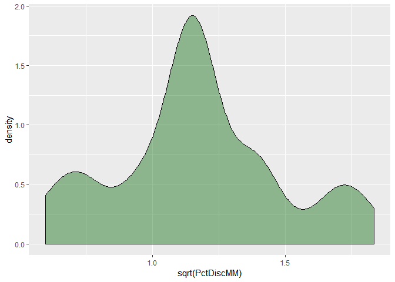

Exploratory data analysis
================

This is a note to self for exploratory data analysis.
-----------------------------------------------------

I decided to use the orange dataset.

1- Loading the data:

``` r
orange <- read.csv('https://raw.githubusercontent.com/selva86/datasets/master/orange_juice_withmissing.csv')
```

Let's have a look at the data:

``` r
str(orange)
```

    ## 'data.frame':    1070 obs. of  18 variables:
    ##  $ Purchase      : Factor w/ 2 levels "CH","MM": 1 1 1 2 1 1 1 1 1 1 ...
    ##  $ WeekofPurchase: int  237 239 245 227 228 230 232 234 235 238 ...
    ##  $ StoreID       : int  1 1 1 1 7 7 7 7 7 7 ...
    ##  $ PriceCH       : num  1.75 1.75 1.86 1.69 1.69 1.69 1.69 1.75 1.75 1.75 ...
    ##  $ PriceMM       : num  1.99 1.99 2.09 1.69 1.69 1.99 1.99 1.99 1.99 1.99 ...
    ##  $ DiscCH        : num  0 0 0.17 0 0 0 0 0 0 0 ...
    ##  $ DiscMM        : num  0 0.3 0 0 0 0 0.4 0.4 0.4 0.4 ...
    ##  $ SpecialCH     : int  0 0 0 0 0 0 1 1 0 0 ...
    ##  $ SpecialMM     : int  0 1 0 0 0 1 1 0 0 0 ...
    ##  $ LoyalCH       : num  0.5 0.6 0.68 0.4 0.957 ...
    ##  $ SalePriceMM   : num  1.99 1.69 2.09 1.69 1.69 1.99 1.59 1.59 1.59 1.59 ...
    ##  $ SalePriceCH   : num  1.75 1.75 1.69 1.69 1.69 1.69 1.69 1.75 1.75 1.75 ...
    ##  $ PriceDiff     : num  0.24 -0.06 0.4 0 0 0.3 -0.1 -0.16 -0.16 -0.16 ...
    ##  $ Store7        : Factor w/ 2 levels "No","Yes": 1 1 1 1 2 2 2 2 2 2 ...
    ##  $ PctDiscMM     : num  0 0.151 0 0 0 ...
    ##  $ PctDiscCH     : num  0 0 0.0914 0 0 ...
    ##  $ ListPriceDiff : num  0.24 0.24 0.23 0 0 0.3 0.3 0.24 0.24 0.24 ...
    ##  $ STORE         : int  1 1 1 1 0 0 0 0 0 0 ...

``` r
glimpse(orange)
```

    ## Observations: 1,070
    ## Variables: 18
    ## $ Purchase       <fct> CH, CH, CH, MM, CH, CH, CH, CH, CH, CH, CH, CH,...
    ## $ WeekofPurchase <int> 237, 239, 245, 227, 228, 230, 232, 234, 235, 23...
    ## $ StoreID        <int> 1, 1, 1, 1, 7, 7, 7, 7, 7, 7, 7, 7, 7, 7, 7, 7,...
    ## $ PriceCH        <dbl> 1.75, 1.75, 1.86, 1.69, 1.69, 1.69, 1.69, 1.75,...
    ## $ PriceMM        <dbl> 1.99, 1.99, 2.09, 1.69, 1.69, 1.99, 1.99, 1.99,...
    ## $ DiscCH         <dbl> 0.00, 0.00, 0.17, 0.00, 0.00, 0.00, 0.00, 0.00,...
    ## $ DiscMM         <dbl> 0.00, 0.30, 0.00, 0.00, 0.00, 0.00, 0.40, 0.40,...
    ## $ SpecialCH      <int> 0, 0, 0, 0, 0, 0, 1, 1, 0, 0, 0, 0, 0, 0, 0, 0,...
    ## $ SpecialMM      <int> 0, 1, 0, 0, 0, 1, 1, 0, 0, 0, 0, 0, 1, 0, 0, 0,...
    ## $ LoyalCH        <dbl> 0.500000, 0.600000, 0.680000, 0.400000, 0.95653...
    ## $ SalePriceMM    <dbl> 1.99, 1.69, 2.09, 1.69, 1.69, 1.99, 1.59, 1.59,...
    ## $ SalePriceCH    <dbl> 1.75, 1.75, 1.69, 1.69, 1.69, 1.69, 1.69, 1.75,...
    ## $ PriceDiff      <dbl> 0.24, -0.06, 0.40, 0.00, 0.00, 0.30, -0.10, -0....
    ## $ Store7         <fct> No, No, No, No, Yes, Yes, Yes, Yes, Yes, Yes, Y...
    ## $ PctDiscMM      <dbl> 0.000000, 0.150754, 0.000000, 0.000000, 0.00000...
    ## $ PctDiscCH      <dbl> 0.000000, 0.000000, 0.091398, 0.000000, 0.00000...
    ## $ ListPriceDiff  <dbl> 0.24, 0.24, 0.23, 0.00, 0.00, 0.30, 0.30, 0.24,...
    ## $ STORE          <int> 1, 1, 1, 1, 0, 0, 0, 0, 0, 0, 0, 0, 0, 0, 0, 0,...

``` r
head(orange)
```

    ##   Purchase WeekofPurchase StoreID PriceCH PriceMM DiscCH DiscMM SpecialCH
    ## 1       CH            237       1    1.75    1.99   0.00    0.0         0
    ## 2       CH            239       1    1.75    1.99   0.00    0.3         0
    ## 3       CH            245       1    1.86    2.09   0.17    0.0         0
    ## 4       MM            227       1    1.69    1.69   0.00    0.0         0
    ## 5       CH            228       7    1.69    1.69   0.00    0.0         0
    ## 6       CH            230       7    1.69    1.99   0.00    0.0         0
    ##   SpecialMM  LoyalCH SalePriceMM SalePriceCH PriceDiff Store7 PctDiscMM
    ## 1         0 0.500000        1.99        1.75      0.24     No  0.000000
    ## 2         1 0.600000        1.69        1.75     -0.06     No  0.150754
    ## 3         0 0.680000        2.09        1.69      0.40     No  0.000000
    ## 4         0 0.400000        1.69        1.69      0.00     No  0.000000
    ## 5         0 0.956535        1.69        1.69      0.00    Yes  0.000000
    ## 6         1 0.965228        1.99        1.69      0.30    Yes  0.000000
    ##   PctDiscCH ListPriceDiff STORE
    ## 1  0.000000          0.24     1
    ## 2  0.000000          0.24     1
    ## 3  0.091398          0.23     1
    ## 4  0.000000          0.00     1
    ## 5  0.000000          0.00     0
    ## 6  0.000000          0.30     0

``` r
summary(orange)
```

    ##  Purchase WeekofPurchase     StoreID         PriceCH         PriceMM     
    ##  CH:653   Min.   :227.0   Min.   :1.000   Min.   :1.690   Min.   :1.690  
    ##  MM:417   1st Qu.:240.0   1st Qu.:2.000   1st Qu.:1.790   1st Qu.:1.990  
    ##           Median :257.0   Median :3.000   Median :1.860   Median :2.090  
    ##           Mean   :254.4   Mean   :3.957   Mean   :1.867   Mean   :2.085  
    ##           3rd Qu.:268.0   3rd Qu.:7.000   3rd Qu.:1.990   3rd Qu.:2.180  
    ##           Max.   :278.0   Max.   :7.000   Max.   :2.090   Max.   :2.290  
    ##                           NA's   :1       NA's   :1       NA's   :4      
    ##      DiscCH            DiscMM         SpecialCH       SpecialMM     
    ##  Min.   :0.00000   Min.   :0.0000   Min.   :0.000   Min.   :0.0000  
    ##  1st Qu.:0.00000   1st Qu.:0.0000   1st Qu.:0.000   1st Qu.:0.0000  
    ##  Median :0.00000   Median :0.0000   Median :0.000   Median :0.0000  
    ##  Mean   :0.05196   Mean   :0.1234   Mean   :0.147   Mean   :0.1624  
    ##  3rd Qu.:0.00000   3rd Qu.:0.2300   3rd Qu.:0.000   3rd Qu.:0.0000  
    ##  Max.   :0.50000   Max.   :0.8000   Max.   :1.000   Max.   :1.0000  
    ##  NA's   :2         NA's   :4        NA's   :2       NA's   :5       
    ##     LoyalCH          SalePriceMM     SalePriceCH      PriceDiff      
    ##  Min.   :0.000011   Min.   :1.190   Min.   :1.390   Min.   :-0.6700  
    ##  1st Qu.:0.320000   1st Qu.:1.690   1st Qu.:1.750   1st Qu.: 0.0000  
    ##  Median :0.600000   Median :2.090   Median :1.860   Median : 0.2300  
    ##  Mean   :0.565203   Mean   :1.962   Mean   :1.816   Mean   : 0.1463  
    ##  3rd Qu.:0.850578   3rd Qu.:2.130   3rd Qu.:1.890   3rd Qu.: 0.3200  
    ##  Max.   :0.999947   Max.   :2.290   Max.   :2.090   Max.   : 0.6400  
    ##  NA's   :5          NA's   :5       NA's   :1       NA's   :1        
    ##  Store7      PctDiscMM         PctDiscCH       ListPriceDiff  
    ##  No :714   Min.   :0.00000   Min.   :0.00000   Min.   :0.000  
    ##  Yes:356   1st Qu.:0.00000   1st Qu.:0.00000   1st Qu.:0.140  
    ##            Median :0.00000   Median :0.00000   Median :0.240  
    ##            Mean   :0.05939   Mean   :0.02732   Mean   :0.218  
    ##            3rd Qu.:0.11268   3rd Qu.:0.00000   3rd Qu.:0.300  
    ##            Max.   :0.40201   Max.   :0.25269   Max.   :0.440  
    ##            NA's   :5         NA's   :2                        
    ##      STORE      
    ##  Min.   :0.000  
    ##  1st Qu.:0.000  
    ##  Median :2.000  
    ##  Mean   :1.628  
    ##  3rd Qu.:3.000  
    ##  Max.   :4.000  
    ##  NA's   :2

This is how like to check NAs, histograms, etc:

``` r
orange%>%
  skimr::skim_to_wide() %>%
  kableExtra::kable() %>%
  kableExtra::kable_styling()
```

<table class="table" style="margin-left: auto; margin-right: auto;">
<thead>
<tr>
<th style="text-align:left;">
type
</th>
<th style="text-align:left;">
variable
</th>
<th style="text-align:left;">
missing
</th>
<th style="text-align:left;">
complete
</th>
<th style="text-align:left;">
n
</th>
<th style="text-align:left;">
n\_unique
</th>
<th style="text-align:left;">
top\_counts
</th>
<th style="text-align:left;">
ordered
</th>
<th style="text-align:left;">
mean
</th>
<th style="text-align:left;">
sd
</th>
<th style="text-align:left;">
p0
</th>
<th style="text-align:left;">
p25
</th>
<th style="text-align:left;">
p50
</th>
<th style="text-align:left;">
p75
</th>
<th style="text-align:left;">
p100
</th>
<th style="text-align:left;">
hist
</th>
</tr>
</thead>
<tbody>
<tr>
<td style="text-align:left;">
factor
</td>
<td style="text-align:left;">
Purchase
</td>
<td style="text-align:left;">
0
</td>
<td style="text-align:left;">
1070
</td>
<td style="text-align:left;">
1070
</td>
<td style="text-align:left;">
2
</td>
<td style="text-align:left;">
CH: 653, MM: 417, NA: 0
</td>
<td style="text-align:left;">
FALSE
</td>
<td style="text-align:left;">
NA
</td>
<td style="text-align:left;">
NA
</td>
<td style="text-align:left;">
NA
</td>
<td style="text-align:left;">
NA
</td>
<td style="text-align:left;">
NA
</td>
<td style="text-align:left;">
NA
</td>
<td style="text-align:left;">
NA
</td>
<td style="text-align:left;">
NA
</td>
</tr>
<tr>
<td style="text-align:left;">
factor
</td>
<td style="text-align:left;">
Store7
</td>
<td style="text-align:left;">
0
</td>
<td style="text-align:left;">
1070
</td>
<td style="text-align:left;">
1070
</td>
<td style="text-align:left;">
2
</td>
<td style="text-align:left;">
No: 714, Yes: 356, NA: 0
</td>
<td style="text-align:left;">
FALSE
</td>
<td style="text-align:left;">
NA
</td>
<td style="text-align:left;">
NA
</td>
<td style="text-align:left;">
NA
</td>
<td style="text-align:left;">
NA
</td>
<td style="text-align:left;">
NA
</td>
<td style="text-align:left;">
NA
</td>
<td style="text-align:left;">
NA
</td>
<td style="text-align:left;">
NA
</td>
</tr>
<tr>
<td style="text-align:left;">
integer
</td>
<td style="text-align:left;">
SpecialCH
</td>
<td style="text-align:left;">
2
</td>
<td style="text-align:left;">
1068
</td>
<td style="text-align:left;">
1070
</td>
<td style="text-align:left;">
NA
</td>
<td style="text-align:left;">
NA
</td>
<td style="text-align:left;">
NA
</td>
<td style="text-align:left;">
0.15
</td>
<td style="text-align:left;">
0.35
</td>
<td style="text-align:left;">
0
</td>
<td style="text-align:left;">
0
</td>
<td style="text-align:left;">
0
</td>
<td style="text-align:left;">
0
</td>
<td style="text-align:left;">
1
</td>
<td style="text-align:left;">
▇▁▁▁▁▁▁▂
</td>
</tr>
<tr>
<td style="text-align:left;">
integer
</td>
<td style="text-align:left;">
SpecialMM
</td>
<td style="text-align:left;">
5
</td>
<td style="text-align:left;">
1065
</td>
<td style="text-align:left;">
1070
</td>
<td style="text-align:left;">
NA
</td>
<td style="text-align:left;">
NA
</td>
<td style="text-align:left;">
NA
</td>
<td style="text-align:left;">
0.16
</td>
<td style="text-align:left;">
0.37
</td>
<td style="text-align:left;">
0
</td>
<td style="text-align:left;">
0
</td>
<td style="text-align:left;">
0
</td>
<td style="text-align:left;">
0
</td>
<td style="text-align:left;">
1
</td>
<td style="text-align:left;">
▇▁▁▁▁▁▁▂
</td>
</tr>
<tr>
<td style="text-align:left;">
integer
</td>
<td style="text-align:left;">
STORE
</td>
<td style="text-align:left;">
2
</td>
<td style="text-align:left;">
1068
</td>
<td style="text-align:left;">
1070
</td>
<td style="text-align:left;">
NA
</td>
<td style="text-align:left;">
NA
</td>
<td style="text-align:left;">
NA
</td>
<td style="text-align:left;">
1.63
</td>
<td style="text-align:left;">
1.43
</td>
<td style="text-align:left;">
0
</td>
<td style="text-align:left;">
0
</td>
<td style="text-align:left;">
2
</td>
<td style="text-align:left;">
3
</td>
<td style="text-align:left;">
4
</td>
<td style="text-align:left;">
▇▃▁▅▁▅▁▃
</td>
</tr>
<tr>
<td style="text-align:left;">
integer
</td>
<td style="text-align:left;">
StoreID
</td>
<td style="text-align:left;">
1
</td>
<td style="text-align:left;">
1069
</td>
<td style="text-align:left;">
1070
</td>
<td style="text-align:left;">
NA
</td>
<td style="text-align:left;">
NA
</td>
<td style="text-align:left;">
NA
</td>
<td style="text-align:left;">
3.96
</td>
<td style="text-align:left;">
2.31
</td>
<td style="text-align:left;">
1
</td>
<td style="text-align:left;">
2
</td>
<td style="text-align:left;">
3
</td>
<td style="text-align:left;">
7
</td>
<td style="text-align:left;">
7
</td>
<td style="text-align:left;">
▃▅▅▃▁▁▁▇
</td>
</tr>
<tr>
<td style="text-align:left;">
integer
</td>
<td style="text-align:left;">
WeekofPurchase
</td>
<td style="text-align:left;">
0
</td>
<td style="text-align:left;">
1070
</td>
<td style="text-align:left;">
1070
</td>
<td style="text-align:left;">
NA
</td>
<td style="text-align:left;">
NA
</td>
<td style="text-align:left;">
NA
</td>
<td style="text-align:left;">
254.38
</td>
<td style="text-align:left;">
15.56
</td>
<td style="text-align:left;">
227
</td>
<td style="text-align:left;">
240
</td>
<td style="text-align:left;">
257
</td>
<td style="text-align:left;">
268
</td>
<td style="text-align:left;">
278
</td>
<td style="text-align:left;">
▆▅▅▃▅▇▆▇
</td>
</tr>
<tr>
<td style="text-align:left;">
numeric
</td>
<td style="text-align:left;">
DiscCH
</td>
<td style="text-align:left;">
2
</td>
<td style="text-align:left;">
1068
</td>
<td style="text-align:left;">
1070
</td>
<td style="text-align:left;">
NA
</td>
<td style="text-align:left;">
NA
</td>
<td style="text-align:left;">
NA
</td>
<td style="text-align:left;">
0.052
</td>
<td style="text-align:left;">
0.12
</td>
<td style="text-align:left;">
0
</td>
<td style="text-align:left;">
0
</td>
<td style="text-align:left;">
0
</td>
<td style="text-align:left;">
0
</td>
<td style="text-align:left;">
0.5
</td>
<td style="text-align:left;">
▇▁▁▁▁▁▁▁
</td>
</tr>
<tr>
<td style="text-align:left;">
numeric
</td>
<td style="text-align:left;">
DiscMM
</td>
<td style="text-align:left;">
4
</td>
<td style="text-align:left;">
1066
</td>
<td style="text-align:left;">
1070
</td>
<td style="text-align:left;">
NA
</td>
<td style="text-align:left;">
NA
</td>
<td style="text-align:left;">
NA
</td>
<td style="text-align:left;">
0.12
</td>
<td style="text-align:left;">
0.21
</td>
<td style="text-align:left;">
0
</td>
<td style="text-align:left;">
0
</td>
<td style="text-align:left;">
0
</td>
<td style="text-align:left;">
0.23
</td>
<td style="text-align:left;">
0.8
</td>
<td style="text-align:left;">
▇▁▁▂▁▁▁▁
</td>
</tr>
<tr>
<td style="text-align:left;">
numeric
</td>
<td style="text-align:left;">
ListPriceDiff
</td>
<td style="text-align:left;">
0
</td>
<td style="text-align:left;">
1070
</td>
<td style="text-align:left;">
1070
</td>
<td style="text-align:left;">
NA
</td>
<td style="text-align:left;">
NA
</td>
<td style="text-align:left;">
NA
</td>
<td style="text-align:left;">
0.22
</td>
<td style="text-align:left;">
0.11
</td>
<td style="text-align:left;">
0
</td>
<td style="text-align:left;">
0.14
</td>
<td style="text-align:left;">
0.24
</td>
<td style="text-align:left;">
0.3
</td>
<td style="text-align:left;">
0.44
</td>
<td style="text-align:left;">
▂▂▂▂▇▆▁▁
</td>
</tr>
<tr>
<td style="text-align:left;">
numeric
</td>
<td style="text-align:left;">
LoyalCH
</td>
<td style="text-align:left;">
5
</td>
<td style="text-align:left;">
1065
</td>
<td style="text-align:left;">
1070
</td>
<td style="text-align:left;">
NA
</td>
<td style="text-align:left;">
NA
</td>
<td style="text-align:left;">
NA
</td>
<td style="text-align:left;">
0.57
</td>
<td style="text-align:left;">
0.31
</td>
<td style="text-align:left;">
1.1e-05
</td>
<td style="text-align:left;">
0.32
</td>
<td style="text-align:left;">
0.6
</td>
<td style="text-align:left;">
0.85
</td>
<td style="text-align:left;">
1
</td>
<td style="text-align:left;">
▅▂▃▃▆▃▃▇
</td>
</tr>
<tr>
<td style="text-align:left;">
numeric
</td>
<td style="text-align:left;">
PctDiscCH
</td>
<td style="text-align:left;">
2
</td>
<td style="text-align:left;">
1068
</td>
<td style="text-align:left;">
1070
</td>
<td style="text-align:left;">
NA
</td>
<td style="text-align:left;">
NA
</td>
<td style="text-align:left;">
NA
</td>
<td style="text-align:left;">
0.027
</td>
<td style="text-align:left;">
0.062
</td>
<td style="text-align:left;">
0
</td>
<td style="text-align:left;">
0
</td>
<td style="text-align:left;">
0
</td>
<td style="text-align:left;">
0
</td>
<td style="text-align:left;">
0.25
</td>
<td style="text-align:left;">
▇▁▁▁▁▁▁▁
</td>
</tr>
<tr>
<td style="text-align:left;">
numeric
</td>
<td style="text-align:left;">
PctDiscMM
</td>
<td style="text-align:left;">
5
</td>
<td style="text-align:left;">
1065
</td>
<td style="text-align:left;">
1070
</td>
<td style="text-align:left;">
NA
</td>
<td style="text-align:left;">
NA
</td>
<td style="text-align:left;">
NA
</td>
<td style="text-align:left;">
0.059
</td>
<td style="text-align:left;">
0.1
</td>
<td style="text-align:left;">
0
</td>
<td style="text-align:left;">
0
</td>
<td style="text-align:left;">
0
</td>
<td style="text-align:left;">
0.11
</td>
<td style="text-align:left;">
0.4
</td>
<td style="text-align:left;">
▇▁▁▂▁▁▁▁
</td>
</tr>
<tr>
<td style="text-align:left;">
numeric
</td>
<td style="text-align:left;">
PriceCH
</td>
<td style="text-align:left;">
1
</td>
<td style="text-align:left;">
1069
</td>
<td style="text-align:left;">
1070
</td>
<td style="text-align:left;">
NA
</td>
<td style="text-align:left;">
NA
</td>
<td style="text-align:left;">
NA
</td>
<td style="text-align:left;">
1.87
</td>
<td style="text-align:left;">
0.1
</td>
<td style="text-align:left;">
1.69
</td>
<td style="text-align:left;">
1.79
</td>
<td style="text-align:left;">
1.86
</td>
<td style="text-align:left;">
1.99
</td>
<td style="text-align:left;">
2.09
</td>
<td style="text-align:left;">
▂▅▁▇▁▁▅▁
</td>
</tr>
<tr>
<td style="text-align:left;">
numeric
</td>
<td style="text-align:left;">
PriceDiff
</td>
<td style="text-align:left;">
1
</td>
<td style="text-align:left;">
1069
</td>
<td style="text-align:left;">
1070
</td>
<td style="text-align:left;">
NA
</td>
<td style="text-align:left;">
NA
</td>
<td style="text-align:left;">
NA
</td>
<td style="text-align:left;">
0.15
</td>
<td style="text-align:left;">
0.27
</td>
<td style="text-align:left;">
-0.67
</td>
<td style="text-align:left;">
0
</td>
<td style="text-align:left;">
0.23
</td>
<td style="text-align:left;">
0.32
</td>
<td style="text-align:left;">
0.64
</td>
<td style="text-align:left;">
▁▁▂▂▃▇▃▂
</td>
</tr>
<tr>
<td style="text-align:left;">
numeric
</td>
<td style="text-align:left;">
PriceMM
</td>
<td style="text-align:left;">
4
</td>
<td style="text-align:left;">
1066
</td>
<td style="text-align:left;">
1070
</td>
<td style="text-align:left;">
NA
</td>
<td style="text-align:left;">
NA
</td>
<td style="text-align:left;">
NA
</td>
<td style="text-align:left;">
2.09
</td>
<td style="text-align:left;">
0.13
</td>
<td style="text-align:left;">
1.69
</td>
<td style="text-align:left;">
1.99
</td>
<td style="text-align:left;">
2.09
</td>
<td style="text-align:left;">
2.18
</td>
<td style="text-align:left;">
2.29
</td>
<td style="text-align:left;">
▁▁▁▃▁▇▃▂
</td>
</tr>
<tr>
<td style="text-align:left;">
numeric
</td>
<td style="text-align:left;">
SalePriceCH
</td>
<td style="text-align:left;">
1
</td>
<td style="text-align:left;">
1069
</td>
<td style="text-align:left;">
1070
</td>
<td style="text-align:left;">
NA
</td>
<td style="text-align:left;">
NA
</td>
<td style="text-align:left;">
NA
</td>
<td style="text-align:left;">
1.82
</td>
<td style="text-align:left;">
0.14
</td>
<td style="text-align:left;">
1.39
</td>
<td style="text-align:left;">
1.75
</td>
<td style="text-align:left;">
1.86
</td>
<td style="text-align:left;">
1.89
</td>
<td style="text-align:left;">
2.09
</td>
<td style="text-align:left;">
▁▁▁▂▆▇▅▁
</td>
</tr>
<tr>
<td style="text-align:left;">
numeric
</td>
<td style="text-align:left;">
SalePriceMM
</td>
<td style="text-align:left;">
5
</td>
<td style="text-align:left;">
1065
</td>
<td style="text-align:left;">
1070
</td>
<td style="text-align:left;">
NA
</td>
<td style="text-align:left;">
NA
</td>
<td style="text-align:left;">
NA
</td>
<td style="text-align:left;">
1.96
</td>
<td style="text-align:left;">
0.25
</td>
<td style="text-align:left;">
1.19
</td>
<td style="text-align:left;">
1.69
</td>
<td style="text-align:left;">
2.09
</td>
<td style="text-align:left;">
2.13
</td>
<td style="text-align:left;">
2.29
</td>
<td style="text-align:left;">
▁▁▃▃▁▂▇▆
</td>
</tr>
</tbody>
</table>
Analysing categorical vars

``` r
levels(orange$Purchase)
```

    ## [1] "CH" "MM"

Categorical vars can be checked against each other

``` r
table(orange$Purchase, orange$Store7)
```

    ##     
    ##       No Yes
    ##   CH 379 274
    ##   MM 335  82

According to skimr report the number of NAs is not propertional to size of the dataset. As a result, we can we can use knnImpute to fix the NAs

``` r
preProcessMissingModel <- caret::preProcess(orange, method = 'knnImpute')

require(RANN)
orange <- predict(preProcessMissingModel, newdata = orange)
```

Checking whether we have any NAs

``` r
anyNA(orange)
```

    ## [1] FALSE

Let's look at the data again:

``` r
orange%>%
  skimr::skim_to_wide() %>%
  kableExtra::kable() %>%
  kableExtra::kable_styling()
```

<table class="table" style="margin-left: auto; margin-right: auto;">
<thead>
<tr>
<th style="text-align:left;">
type
</th>
<th style="text-align:left;">
variable
</th>
<th style="text-align:left;">
missing
</th>
<th style="text-align:left;">
complete
</th>
<th style="text-align:left;">
n
</th>
<th style="text-align:left;">
n\_unique
</th>
<th style="text-align:left;">
top\_counts
</th>
<th style="text-align:left;">
ordered
</th>
<th style="text-align:left;">
mean
</th>
<th style="text-align:left;">
sd
</th>
<th style="text-align:left;">
p0
</th>
<th style="text-align:left;">
p25
</th>
<th style="text-align:left;">
p50
</th>
<th style="text-align:left;">
p75
</th>
<th style="text-align:left;">
p100
</th>
<th style="text-align:left;">
hist
</th>
</tr>
</thead>
<tbody>
<tr>
<td style="text-align:left;">
factor
</td>
<td style="text-align:left;">
Purchase
</td>
<td style="text-align:left;">
0
</td>
<td style="text-align:left;">
1070
</td>
<td style="text-align:left;">
1070
</td>
<td style="text-align:left;">
2
</td>
<td style="text-align:left;">
CH: 653, MM: 417, NA: 0
</td>
<td style="text-align:left;">
FALSE
</td>
<td style="text-align:left;">
NA
</td>
<td style="text-align:left;">
NA
</td>
<td style="text-align:left;">
NA
</td>
<td style="text-align:left;">
NA
</td>
<td style="text-align:left;">
NA
</td>
<td style="text-align:left;">
NA
</td>
<td style="text-align:left;">
NA
</td>
<td style="text-align:left;">
NA
</td>
</tr>
<tr>
<td style="text-align:left;">
factor
</td>
<td style="text-align:left;">
Store7
</td>
<td style="text-align:left;">
0
</td>
<td style="text-align:left;">
1070
</td>
<td style="text-align:left;">
1070
</td>
<td style="text-align:left;">
2
</td>
<td style="text-align:left;">
No: 714, Yes: 356, NA: 0
</td>
<td style="text-align:left;">
FALSE
</td>
<td style="text-align:left;">
NA
</td>
<td style="text-align:left;">
NA
</td>
<td style="text-align:left;">
NA
</td>
<td style="text-align:left;">
NA
</td>
<td style="text-align:left;">
NA
</td>
<td style="text-align:left;">
NA
</td>
<td style="text-align:left;">
NA
</td>
<td style="text-align:left;">
NA
</td>
</tr>
<tr>
<td style="text-align:left;">
numeric
</td>
<td style="text-align:left;">
DiscCH
</td>
<td style="text-align:left;">
0
</td>
<td style="text-align:left;">
1070
</td>
<td style="text-align:left;">
1070
</td>
<td style="text-align:left;">
NA
</td>
<td style="text-align:left;">
NA
</td>
<td style="text-align:left;">
NA
</td>
<td style="text-align:left;">
-0.00083
</td>
<td style="text-align:left;">
1
</td>
<td style="text-align:left;">
-0.44
</td>
<td style="text-align:left;">
-0.44
</td>
<td style="text-align:left;">
-0.44
</td>
<td style="text-align:left;">
-0.44
</td>
<td style="text-align:left;">
3.81
</td>
<td style="text-align:left;">
▇▁▁▁▁▁▁▁
</td>
</tr>
<tr>
<td style="text-align:left;">
numeric
</td>
<td style="text-align:left;">
DiscMM
</td>
<td style="text-align:left;">
0
</td>
<td style="text-align:left;">
1070
</td>
<td style="text-align:left;">
1070
</td>
<td style="text-align:left;">
NA
</td>
<td style="text-align:left;">
NA
</td>
<td style="text-align:left;">
NA
</td>
<td style="text-align:left;">
-2e-04
</td>
<td style="text-align:left;">
1
</td>
<td style="text-align:left;">
-0.58
</td>
<td style="text-align:left;">
-0.58
</td>
<td style="text-align:left;">
-0.58
</td>
<td style="text-align:left;">
0.51
</td>
<td style="text-align:left;">
3.16
</td>
<td style="text-align:left;">
▇▁▁▂▁▁▁▁
</td>
</tr>
<tr>
<td style="text-align:left;">
numeric
</td>
<td style="text-align:left;">
ListPriceDiff
</td>
<td style="text-align:left;">
0
</td>
<td style="text-align:left;">
1070
</td>
<td style="text-align:left;">
1070
</td>
<td style="text-align:left;">
NA
</td>
<td style="text-align:left;">
NA
</td>
<td style="text-align:left;">
NA
</td>
<td style="text-align:left;">
-2.5e-17
</td>
<td style="text-align:left;">
1
</td>
<td style="text-align:left;">
-2.03
</td>
<td style="text-align:left;">
-0.73
</td>
<td style="text-align:left;">
0.2
</td>
<td style="text-align:left;">
0.76
</td>
<td style="text-align:left;">
2.06
</td>
<td style="text-align:left;">
▂▂▂▂▇▆▁▁
</td>
</tr>
<tr>
<td style="text-align:left;">
numeric
</td>
<td style="text-align:left;">
LoyalCH
</td>
<td style="text-align:left;">
0
</td>
<td style="text-align:left;">
1070
</td>
<td style="text-align:left;">
1070
</td>
<td style="text-align:left;">
NA
</td>
<td style="text-align:left;">
NA
</td>
<td style="text-align:left;">
NA
</td>
<td style="text-align:left;">
-0.0011
</td>
<td style="text-align:left;">
1
</td>
<td style="text-align:left;">
-1.83
</td>
<td style="text-align:left;">
-0.8
</td>
<td style="text-align:left;">
0.11
</td>
<td style="text-align:left;">
0.93
</td>
<td style="text-align:left;">
1.41
</td>
<td style="text-align:left;">
▅▂▃▃▆▃▃▇
</td>
</tr>
<tr>
<td style="text-align:left;">
numeric
</td>
<td style="text-align:left;">
PctDiscCH
</td>
<td style="text-align:left;">
0
</td>
<td style="text-align:left;">
1070
</td>
<td style="text-align:left;">
1070
</td>
<td style="text-align:left;">
NA
</td>
<td style="text-align:left;">
NA
</td>
<td style="text-align:left;">
NA
</td>
<td style="text-align:left;">
-6.6e-05
</td>
<td style="text-align:left;">
1
</td>
<td style="text-align:left;">
-0.44
</td>
<td style="text-align:left;">
-0.44
</td>
<td style="text-align:left;">
-0.44
</td>
<td style="text-align:left;">
-0.44
</td>
<td style="text-align:left;">
3.62
</td>
<td style="text-align:left;">
▇▁▁▁▁▁▁▁
</td>
</tr>
<tr>
<td style="text-align:left;">
numeric
</td>
<td style="text-align:left;">
PctDiscMM
</td>
<td style="text-align:left;">
0
</td>
<td style="text-align:left;">
1070
</td>
<td style="text-align:left;">
1070
</td>
<td style="text-align:left;">
NA
</td>
<td style="text-align:left;">
NA
</td>
<td style="text-align:left;">
NA
</td>
<td style="text-align:left;">
-0.00097
</td>
<td style="text-align:left;">
1
</td>
<td style="text-align:left;">
-0.58
</td>
<td style="text-align:left;">
-0.58
</td>
<td style="text-align:left;">
-0.58
</td>
<td style="text-align:left;">
0.52
</td>
<td style="text-align:left;">
3.36
</td>
<td style="text-align:left;">
▇▁▁▂▁▁▁▁
</td>
</tr>
<tr>
<td style="text-align:left;">
numeric
</td>
<td style="text-align:left;">
PriceCH
</td>
<td style="text-align:left;">
0
</td>
<td style="text-align:left;">
1070
</td>
<td style="text-align:left;">
1070
</td>
<td style="text-align:left;">
NA
</td>
<td style="text-align:left;">
NA
</td>
<td style="text-align:left;">
NA
</td>
<td style="text-align:left;">
-0.00025
</td>
<td style="text-align:left;">
1
</td>
<td style="text-align:left;">
-1.74
</td>
<td style="text-align:left;">
-0.76
</td>
<td style="text-align:left;">
-0.073
</td>
<td style="text-align:left;">
1.2
</td>
<td style="text-align:left;">
2.18
</td>
<td style="text-align:left;">
▂▃▂▇▁▁▆▁
</td>
</tr>
<tr>
<td style="text-align:left;">
numeric
</td>
<td style="text-align:left;">
PriceDiff
</td>
<td style="text-align:left;">
0
</td>
<td style="text-align:left;">
1070
</td>
<td style="text-align:left;">
1070
</td>
<td style="text-align:left;">
NA
</td>
<td style="text-align:left;">
NA
</td>
<td style="text-align:left;">
NA
</td>
<td style="text-align:left;">
6e-04
</td>
<td style="text-align:left;">
1
</td>
<td style="text-align:left;">
-3.01
</td>
<td style="text-align:left;">
-0.54
</td>
<td style="text-align:left;">
0.31
</td>
<td style="text-align:left;">
0.64
</td>
<td style="text-align:left;">
1.82
</td>
<td style="text-align:left;">
▁▁▂▂▃▇▃▂
</td>
</tr>
<tr>
<td style="text-align:left;">
numeric
</td>
<td style="text-align:left;">
PriceMM
</td>
<td style="text-align:left;">
0
</td>
<td style="text-align:left;">
1070
</td>
<td style="text-align:left;">
1070
</td>
<td style="text-align:left;">
NA
</td>
<td style="text-align:left;">
NA
</td>
<td style="text-align:left;">
NA
</td>
<td style="text-align:left;">
0.0028
</td>
<td style="text-align:left;">
1
</td>
<td style="text-align:left;">
-2.94
</td>
<td style="text-align:left;">
-0.71
</td>
<td style="text-align:left;">
0.037
</td>
<td style="text-align:left;">
0.71
</td>
<td style="text-align:left;">
1.52
</td>
<td style="text-align:left;">
▁▁▁▁▃▇▃▂
</td>
</tr>
<tr>
<td style="text-align:left;">
numeric
</td>
<td style="text-align:left;">
SalePriceCH
</td>
<td style="text-align:left;">
0
</td>
<td style="text-align:left;">
1070
</td>
<td style="text-align:left;">
1070
</td>
<td style="text-align:left;">
NA
</td>
<td style="text-align:left;">
NA
</td>
<td style="text-align:left;">
NA
</td>
<td style="text-align:left;">
0.00029
</td>
<td style="text-align:left;">
1
</td>
<td style="text-align:left;">
-2.97
</td>
<td style="text-align:left;">
-0.46
</td>
<td style="text-align:left;">
0.31
</td>
<td style="text-align:left;">
0.52
</td>
<td style="text-align:left;">
1.91
</td>
<td style="text-align:left;">
▁▁▁▂▆▇▅▁
</td>
</tr>
<tr>
<td style="text-align:left;">
numeric
</td>
<td style="text-align:left;">
SalePriceMM
</td>
<td style="text-align:left;">
0
</td>
<td style="text-align:left;">
1070
</td>
<td style="text-align:left;">
1070
</td>
<td style="text-align:left;">
NA
</td>
<td style="text-align:left;">
NA
</td>
<td style="text-align:left;">
NA
</td>
<td style="text-align:left;">
0.00045
</td>
<td style="text-align:left;">
1
</td>
<td style="text-align:left;">
-3.06
</td>
<td style="text-align:left;">
-1.08
</td>
<td style="text-align:left;">
0.51
</td>
<td style="text-align:left;">
0.67
</td>
<td style="text-align:left;">
1.3
</td>
<td style="text-align:left;">
▁▁▃▃▁▂▇▆
</td>
</tr>
<tr>
<td style="text-align:left;">
numeric
</td>
<td style="text-align:left;">
SpecialCH
</td>
<td style="text-align:left;">
0
</td>
<td style="text-align:left;">
1070
</td>
<td style="text-align:left;">
1070
</td>
<td style="text-align:left;">
NA
</td>
<td style="text-align:left;">
NA
</td>
<td style="text-align:left;">
NA
</td>
<td style="text-align:left;">
-0.00025
</td>
<td style="text-align:left;">
1
</td>
<td style="text-align:left;">
-0.41
</td>
<td style="text-align:left;">
-0.41
</td>
<td style="text-align:left;">
-0.41
</td>
<td style="text-align:left;">
-0.41
</td>
<td style="text-align:left;">
2.41
</td>
<td style="text-align:left;">
▇▁▁▁▁▁▁▂
</td>
</tr>
<tr>
<td style="text-align:left;">
numeric
</td>
<td style="text-align:left;">
SpecialMM
</td>
<td style="text-align:left;">
0
</td>
<td style="text-align:left;">
1070
</td>
<td style="text-align:left;">
1070
</td>
<td style="text-align:left;">
NA
</td>
<td style="text-align:left;">
NA
</td>
<td style="text-align:left;">
NA
</td>
<td style="text-align:left;">
0.00048
</td>
<td style="text-align:left;">
1
</td>
<td style="text-align:left;">
-0.44
</td>
<td style="text-align:left;">
-0.44
</td>
<td style="text-align:left;">
-0.44
</td>
<td style="text-align:left;">
-0.44
</td>
<td style="text-align:left;">
2.27
</td>
<td style="text-align:left;">
▇▁▁▁▁▁▁▂
</td>
</tr>
<tr>
<td style="text-align:left;">
numeric
</td>
<td style="text-align:left;">
STORE
</td>
<td style="text-align:left;">
0
</td>
<td style="text-align:left;">
1070
</td>
<td style="text-align:left;">
1070
</td>
<td style="text-align:left;">
NA
</td>
<td style="text-align:left;">
NA
</td>
<td style="text-align:left;">
NA
</td>
<td style="text-align:left;">
0.0018
</td>
<td style="text-align:left;">
1
</td>
<td style="text-align:left;">
-1.14
</td>
<td style="text-align:left;">
-1.14
</td>
<td style="text-align:left;">
0.26
</td>
<td style="text-align:left;">
0.96
</td>
<td style="text-align:left;">
1.66
</td>
<td style="text-align:left;">
▇▃▁▅▁▅▁▃
</td>
</tr>
<tr>
<td style="text-align:left;">
numeric
</td>
<td style="text-align:left;">
StoreID
</td>
<td style="text-align:left;">
0
</td>
<td style="text-align:left;">
1070
</td>
<td style="text-align:left;">
1070
</td>
<td style="text-align:left;">
NA
</td>
<td style="text-align:left;">
NA
</td>
<td style="text-align:left;">
NA
</td>
<td style="text-align:left;">
0.0012
</td>
<td style="text-align:left;">
1
</td>
<td style="text-align:left;">
-1.28
</td>
<td style="text-align:left;">
-0.85
</td>
<td style="text-align:left;">
-0.41
</td>
<td style="text-align:left;">
1.32
</td>
<td style="text-align:left;">
1.32
</td>
<td style="text-align:left;">
▃▅▅▁▃▁▁▇
</td>
</tr>
<tr>
<td style="text-align:left;">
numeric
</td>
<td style="text-align:left;">
WeekofPurchase
</td>
<td style="text-align:left;">
0
</td>
<td style="text-align:left;">
1070
</td>
<td style="text-align:left;">
1070
</td>
<td style="text-align:left;">
NA
</td>
<td style="text-align:left;">
NA
</td>
<td style="text-align:left;">
NA
</td>
<td style="text-align:left;">
5e-16
</td>
<td style="text-align:left;">
1
</td>
<td style="text-align:left;">
-1.76
</td>
<td style="text-align:left;">
-0.92
</td>
<td style="text-align:left;">
0.17
</td>
<td style="text-align:left;">
0.88
</td>
<td style="text-align:left;">
1.52
</td>
<td style="text-align:left;">
▆▅▅▃▅▇▆▇
</td>
</tr>
</tbody>
</table>
Visually, we can detect some of the variables are skewed, but let's do it automatically. We are going to use moments library.

``` r
require(moments)
```

    ## Loading required package: moments

    ## Warning: package 'moments' was built under R version 3.5.2

``` r
skewness.info <- orange %>% 
  select(-Purchase, -Store7) %>% #exclusing categorical vars
  skewness() %>% 
  data.frame()

skewness.info$Variables <- rownames(skewness.info)
colnames(skewness.info) <- c("Skewness", "Variable")

skewness.info %>% 
  ggplot(aes(x=Variable, y=Skewness))+
  geom_bar(stat = "identity", fill="darkgreen", alpha=.7)+
  coord_flip()
```


Positive skewness means it's skewed towards right.

A next step would be to transorm some variables. PctDiscMM is a good candidate, according to the skewness plot. Let's have a look at its density:

``` r
orange %>% 
  ggplot(aes(x=PctDiscMM))+
  geom_density(fill="darkgreen", alpha=.4)
```


Same variable after log transform:

``` r
orange %>% 
  ggplot(aes(x=log(PctDiscMM)))+
  geom_density(fill="darkgreen", alpha=.4)
```

    ## Warning in log(PctDiscMM): NaNs produced

    ## Warning in log(PctDiscMM): NaNs produced

    ## Warning: Removed 770 rows containing non-finite values (stat_density).


And after square root transformation:

``` r
orange %>% 
  ggplot(aes(x=sqrt(PctDiscMM)))+
  geom_density(fill="darkgreen", alpha=.4)
```

    ## Warning in sqrt(PctDiscMM): NaNs produced

    ## Warning in sqrt(PctDiscMM): NaNs produced

    ## Warning: Removed 770 rows containing non-finite values (stat_density).



A next step would be to check for outliers. \[will be added later..\]

Analysis of variance. Let's assume there's a dependent variable and a few independent var. ANOVA is easy

``` r
aov.ex <- aov(orange$PriceDiff~orange$PriceCH*orange$SpecialCH*orange$ListPriceDiff)
summary(aov.ex)
```

    ##                                                        Df Sum Sq Mean Sq
    ## orange$PriceCH                                          1    9.9    9.88
    ## orange$SpecialCH                                        1   15.3   15.31
    ## orange$ListPriceDiff                                    1  209.7  209.67
    ## orange$PriceCH:orange$SpecialCH                         1    0.0    0.03
    ## orange$PriceCH:orange$ListPriceDiff                     1    5.6    5.58
    ## orange$SpecialCH:orange$ListPriceDiff                   1   13.9   13.85
    ## orange$PriceCH:orange$SpecialCH:orange$ListPriceDiff    1   63.7   63.71
    ## Residuals                                            1062  750.4    0.71
    ##                                                      F value   Pr(>F)    
    ## orange$PriceCH                                        13.990 0.000194 ***
    ## orange$SpecialCH                                      21.665 3.66e-06 ***
    ## orange$ListPriceDiff                                 296.745  < 2e-16 ***
    ## orange$PriceCH:orange$SpecialCH                        0.036 0.849476    
    ## orange$PriceCH:orange$ListPriceDiff                    7.900 0.005035 ** 
    ## orange$SpecialCH:orange$ListPriceDiff                 19.608 1.05e-05 ***
    ## orange$PriceCH:orange$SpecialCH:orange$ListPriceDiff  90.171  < 2e-16 ***
    ## Residuals                                                                
    ## ---
    ## Signif. codes:  0 '***' 0.001 '**' 0.01 '*' 0.05 '.' 0.1 ' ' 1

The stars next to the variables show the significant variables.
